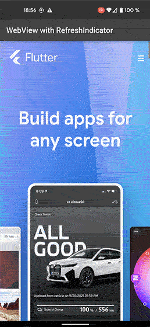

# Flutter Web Refresh

Pull down to refresh `WebView` Page in flutter with `RefreshIndicator`.
Tested with `webview_flutter : ^4.4.2`.



## Getting Started

A simple working solution of pull down to refresh `WebView` page with `RefreshIndicator` and without
`SingleChildScrollView` which causes issues with the `WebView` page scroll behavior of the rendered sites:

This version **resolves** following **issues** w/o `SingleChildScrollView`:
- `SingleChildScrollView` has always the absolute height of the page 
  e.g. if a text box was not expanded from the beginning (javascript), 
  the scroll height **exceeds** the page **height**.
- The WebView gets the whole scroll area height, but doesn't know the display size, 
  so if a bottom or top modal sheet appears, they are **not** **rendered** **correctly** in the view area 
  of the screen but in the absolute complete height of the scroll area, so then you have to scroll 
  e.g. 6000px up and down.
- The **scroll** **position** **stays** where you left somewhere in your previous absolute page height, 
  if you browse further w/o a page refresh.

## Constants 
- `exceedsLoadingTime`: Checks if loading time exceeds a maximum time (e.g. 3 seconds)
  to re-allow drag to refresh if page is still loading (Check [pull_to_refresh.dart](./lib/pull_to_refresh.dart)).
- <s>`REFRESH_DISTANCE_MIN`: Calculates in [pull_to_refresh.dart](./lib/pull_to_refresh.dart) from the screen size 
  the needed dragging distance to start the refresh process (default is `0.2` WebView screen pixels).</s>

## Update
I changed using `ScrollNotification` which `RefreshIndicator` interprets right when `FixedScrollMetrics` are set. So we have the original animation like in `SingleChildScrollView` or e.g. `chrome browser`.

## Usage
Just use `DragGesturePullToRefresh` from my [pull_to_refresh.dart](./lib/pull_to_refresh.dart) like in my [webview.dart](./lib/webview.dart) example in yours (commented with `// Here`), that's it:
```dart
import 'package:flutter/foundation.dart';
import 'package:flutter/material.dart';
import 'package:flutter_web_refresh/pull_to_refresh.dart';
import 'package:webview_flutter/webview_flutter.dart';

class MyWebViewWidget extends StatefulWidget {
  final String initialUrl;

  const MyWebViewWidget({
    Key? key,
    required this.initialUrl,
  }) : super(key: key);

  @override
  State<MyWebViewWidget> createState() => _MyWebViewWidgetState();
}

class _MyWebViewWidgetState extends State<MyWebViewWidget>
        with WidgetsBindingObserver {

  WebViewController _controller = WebViewController();
  late DragGesturePullToRefresh dragGesturePullToRefresh; // Here

  @override
  void initState() {
    super.initState();

    dragGesturePullToRefresh = DragGesturePullToRefresh(); // Here
    _controller = WebViewController()
      ..setJavaScriptMode(JavaScriptMode.unrestricted)
      ..enableZoom(true)
      ..getScrollPosition()
      ..setNavigationDelegate(
        NavigationDelegate(
          onPageStarted: (String url) {
            // Don't allow RefreshIndicator if page is loading, but not needed
            dragGesturePullToRefresh.started(); // Here
          },
          onPageFinished: (String url) {
            // Hide RefreshIndicator for page reload if showing
            dragGesturePullToRefresh.finished(); // Here
          },
          onWebResourceError: (WebResourceError error) {
            //debugPrint('MyWebViewWidget:onWebResourceError(): ${error.description}');
            // Hide RefreshIndicator for page reload if showing
            dragGesturePullToRefresh.finished(); // Here
          },
        ),
      )
      ..loadRequest(Uri.parse(widget.initialUrl));

    dragGesturePullToRefresh // Here
            .setController(_controller)
            .setDragHeightEnd(200)
            .setDragStartYDiff(10)
            .setWaitToRestart(3000);

    //setState(() {});
    WidgetsBinding.instance.addObserver(this);
  }

  @override
  void dispose() {
    // remove listener
    WidgetsBinding.instance.removeObserver(this);
    super.dispose();
  }

  @override
  Widget build(context) {
    return RefreshIndicator(
      triggerMode: RefreshIndicatorTriggerMode.onEdge,
      onRefresh: dragGesturePullToRefresh.refresh, // Here
      child: Builder(
        builder: (context) {
          // IMPORTANT: Use the RefreshIndicator context!
          dragGesturePullToRefresh.setContext(context); // Here
          return WebViewWidget(
            controller: _controller,
            // Add it to the WebViewWidget
            gestureRecognizers: {Factory(() => dragGesturePullToRefresh)}, // Here
          );
        },
      ),
    );
  }
}
```

## Differences w/o `SingleChildScrollView` or to e.g. the chrome browser

- <s>The `RefreshIndicator` shows no initial animation by dragging it down until the distance
  is reached to start the refresh process.</s>
- <s>The web page scrolling is not blocked, when you start to drag down from the top position of
  the page to start the refresh process, e.g. like in the chrome browser. So the refresh process
  is stopped if start to drag down from the page's top position and then up before reaching
  the distance to start the refresh process. Check the method in `refreshPage()` in the [pull_to_refresh.dart](./lib/pull_to_refresh.dart)</s>

## Resources

- [Original idea with updating height of SingleChildScrollView](https://stackoverflow.com/questions/68870975/flutter-how-to-make-pull-down-to-refresh-flutter-webview-using-the-official-web)
- [Idea for usind drag gesture recognizer](https://stackoverflow.com/questions/57656045/pull-down-to-refresh-webview-page-in-flutter)
- [Issue: flutter webview VerticalDragGestureRecognizer get no callback but only onDown and onCance](https://github.com/flutter/flutter/issues/39389)
- [[webview_flutter] added onPullToRefresh to the WebView()](https://github.com/flutter/plugins/pull/3695)
- [Unable to add pull to refresh functionality to the webview_flutter](https://github.com/flutter/flutter/issues/71341)

